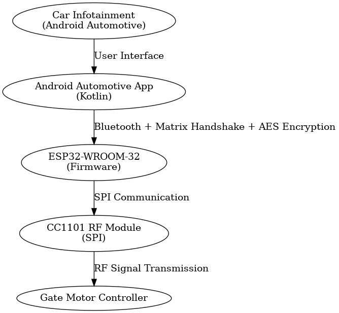

# Smart Automotive Gate Opener (EZI.T)

## 📌 Overview
The **Smart Automotive Gate Opener (EZI.T)** is a secure, modern alternative to traditional RF remote gate controllers.  
It integrates an Android Automotive app with an ESP32-based RF system to allow gate access directly from a vehicle's infotainment system — eliminating the need for physical remotes.

## 🚀 Features
- **Secure Bluetooth Communication** between Android Automotive app and ESP32.
- **RF Signal Transmission** via CC1101 module to trigger gate motor.
- **Matrix-based Handshake + AES Encryption** for enhanced security.
- **Real-time Feedback** through infotainment system.
- **Scalable Design** for multiple access points (garages, parking lots, etc.).

## 🛠 Technology Stack
| Component    | Technology Used |
|--------------|----------------|
| Hardware     | ESP32-WROOM-32, CC1101 RF module, Motor Controller |
| Communication| Bluetooth (ESP32 ↔ App), RF (ESP32 ↔ Gate) |
| Security     | Matrix Handshake, AES Encryption |
| Software     | Android Studio (Kotlin), PlatformIO (Arduino Framework for ESP32) |

## 📷 System Architecture

## 📜 License
This project is licensed under the MIT License.  
See [LICENSE](LICENSE) for more information.

## 👤 Author
**João Bessa**  
BSc in Electrical and Computer Engineering, ISEP
